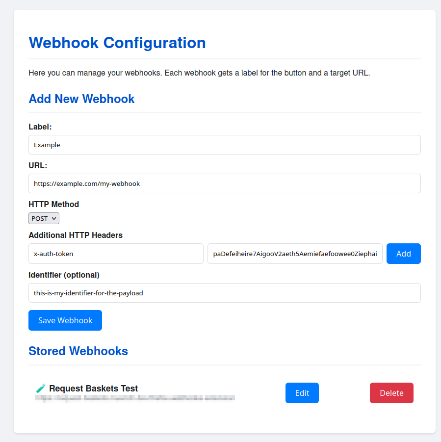

# 🚀 Webhook Trigger Browser Extension

Easily manage and trigger webhooks directly from your browser! Compatible with Firefox and Chrome, this extension lets you send HTTP requests to custom endpoints—perfect for automation services, APIs, or personal scripts.

## ✨ Features

- **📝 Manage Webhooks:** Add, edit, and remove webhook URLs from the options page.
- **🔀 Reorder Webhooks:** Drag-and-drop to arrange your hooks.
- **⚡ Trigger Webhooks:** Instantly send requests from the popup menu.
- **🎨 Customizable:** Use multiple webhooks with custom names and endpoints.
- **💾 Persistent Storage:** Webhooks are stored locally and persist across sessions.
- **🌍 Localization:** Available in multiple languages (see `_locales/`).
- **📤 Export/Import:** Backup or restore your webhooks using JSON files.
- **🗂️ Group Webhooks:** Organize webhooks into groups for clarity and easier management.
- **🧪 Test Webhooks:** Test your webhooks right from the options page to ensure they are configured correctly.

## 🛠️ Getting Started

- **📥 Install the Extension:**
  - **Firefox:** [addons.mozilla.org](https://addons.mozilla.org)
  - **Chrome:** [Chrome Web Store](https://chromewebstore.google.com/detail/webhook-trigger/finanbjnojdckpeklepocgcngcikdlfe)
  - Or load unpacked in Chrome via `chrome://extensions` (Developer mode > "Load unpacked")

- **⚙️ Open Options:**
  - Right-click the extension icon and select "Options" or open from the popup menu.

## ⚡ Managing Webhooks



**➕ Add a Webhook:**
- Go to the options page.
- Enter a name and URL, then click "Add".

**✏️ Edit a Webhook:**
- Find the webhook, click "Edit", update details, and click "Save".

**🗑️ Delete a Webhook:**
- Find the webhook, click "Delete".

**🧪 Test a Webhook:**
- When adding or editing a webhook, click the 'Test' button to send a test payload to your URL.

**🕒 DateTime Variables in Custom Payload:**
- You can use `{{now.*}}` placeholders in custom payload JSON, including UTC values like `{{now.iso}}`, `{{now.date}}`, `{{now.time}}`, `{{now.unix}}`, and local values like `{{now.local.iso}}`.
- Existing `{{triggeredAt}}` remains available as an alias for `{{now.iso}}` for backward compatibility.

**🗂️ Organize into Groups:**
- Use the group management dialog to add, delete, rename, or reorder groups via drag-and-drop.

---

For more details, see the documentation or explore the extension's options page.

## 🧑‍💻 Development & Contributing

- **🔗 Clone the repository:**
  ```sh
  git clone <repository-url>
  cd <project-directory>
  ```
- **📁 Review the project structure:**
  - `manifest.json`: Extension manifest file.
  - `popup/`: Popup UI and logic.
  - `options/`: Options page UI and logic.
  - `_locales/`: Localization files.
  - `icons/`: Extension icons.
- Edit code in `popup/` or `options/` as needed. Update `manifest.json` for permissions or features. Add or update translations in `_locales/`.
- **⚠️ Do not use Unsafe assignment to innerHTML.**
- Test the extension in Firefox via `about:debugging#/runtime/this-firefox` > "Load Temporary Add-on..." and select `manifest.json`.
- Reload the extension after changes to see updates.

## 🧪 Testing, Linting, and Building

- **🧪 Run tests:**
  ```sh
  npm test
  ```
- **🧹 Lint the code:**
  ```sh
  npm run lint
  ```
- **🏗️ Build the extension:**
  ```sh
  npm run build
  ```

## 📦 Packaging
- To distribute, zip the extension files (excluding unnecessary files like `.git/` or local configs) and submit to [Firefox Add-ons](https://addons.mozilla.org/).

## 🤝 Contributing
- Follow standard pull request and code review practices.
- Keep code readable and well-documented.
- Update documentation and translations as needed.

## 📄 License
See `LICENSE` for details.
